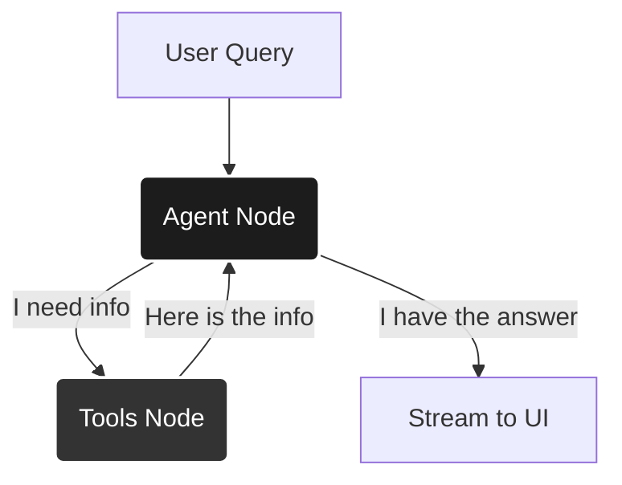

# Matrix AI 🧠

**Matrix AI** is a next-generation **Retrieval-Augmented Generation (RAG)** search engine designed to provide accurate, real-time answers by grounding LLMs in up-to-the-second web data.

Unlike standard chatbots, Matrix AI uses a **ReAct (Reasoning + Acting) Graph** architecture to plan searches, evaluate results, and synthesize comprehensive answers.

---

## 🏗️ System Architecture (The "Node" Explanation)

The core of Matrix AI is built on **LangGraph**, which models the AI's behavior as a cyclic graph rather than a linear chain. This allows the system to self-correct and iterate.

### 🧩 The Graph Nodes

The system consists of two primary nodes that form a continuous loop:

#### 1. `agent` Node (The Brain) 🧠
*   **Role:** The Decision Maker.
*   **Input:** Conversation History + User Query + System Prompt.
*   **Responsibility:**
    *   It analyzes the user's request.
    *   It decides **IF** it needs external information.
    *   It generates a **Tool Call** (e.g., "Search for 'Latest AI News'").
    *   If it has enough info, it generates the **Final Answer**.

#### 2. `tools` Node (The Hands) 🛠️
*   **Role:** The Executor.
*   **Input:** A specific instruction from the Agent (e.g., `web_search(query="...")`).
*   **Responsibility:**
    *   It executes the Python function (calls Google Search, scrapes a URL, runs a calculation).
    *   It returns the **raw output** (text snippets, JSON) back to the `agent` node.

### 🔄 The Execution Flow (ReAct Loop)



---

## 🛠️ Technology Stack

*   **Frontend:** [Next.js 14](https://nextjs.org/) (React, TypeScript, Tailwind CSS)
*   **Backend:** [FastAPI](https://fastapi.tiangolo.com/) (Python)
*   **Orchestration:** [LangGraph](https://python.langchain.com/docs/langgraph)
*   **Inference:** Groq (Llama 3 70B)
*   **Caching:** Redis (Semantic Cache)

---

## 🚀 Installation & Setup

### Prerequisites
*   Python 3.9+
*   Node.js 16+
*   Redis Server

### 1. Backend Setup (The Brain)
```bash
cd backend
python -m venv .venv
# Windows:
.venv\Scripts\activate
# Linux/Mac:
# source .venv/bin/activate

pip install -r requirements.txt

# Start the Async Server
python run.py
```
*Runs on `http://localhost:8000`*

### 2. Frontend Setup (The Interface)
```bash
cd matref-search-frontend
npm install
npm run dev
```
*Runs on `http://localhost:3000`*

---

## 🔑 Configuration (.env)

Create a `.env` file in the `backend` directory:

```env
GROQ_API_KEY=your_key
TAVILY_API_KEY=your_key
REDIS_URL=redis://localhost:6379/0
```

---

## 🎓 Interview Key Concepts

If asked about **"Scalability"**:
> "The storage is stateless. We use Redis for semantic caching to instant-answer repeated queries, and the backend can scale horizontally on Kubernetes."

If asked about **"State Management"**:
> "We use LangGraph's checkpointer. Every step (Thought/Action) is saved. If the server crashes, we can resume the agent exactly where it left off."
